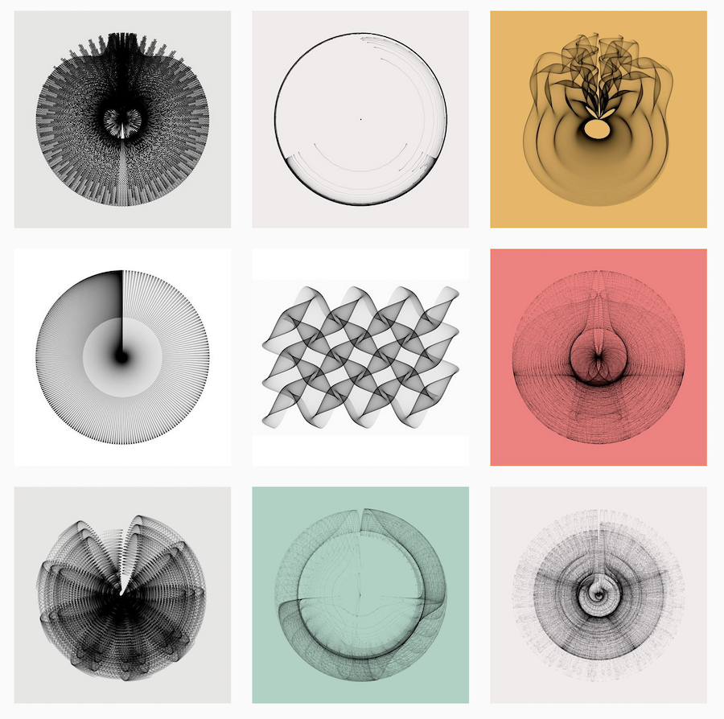

```{r setup, include=FALSE}
options(htmltools.dir.version = FALSE)
knitr::opts_chunk$set(fig.retina = 3, warning = FALSE, message = FALSE)
```

# What do you need to know about me?
--
My name is written *Димитър* and is pronounced *[diˈ mitər]*.

--
I am *not* a programmer.

--
I have done a fair bit of data analysis and some programming.

--
I like pictures.

---
class: center, inverse, top

background-image: url("figs/mip_env_country.png")
background-size: contain

# Here is a picture that I like (done in R)

---
class: center, inverse, top

background-image: url("http://dimiter.eu/thumb/DSC_3484.jpg")
background-size: contain

# This is not done in R (yes, there's [more](http://dimiter.eu/Photos.html))

---
# What is R?

--
## R is the best thing since sliced bread,

--
class: center

    

--
class: left

## only much better, because...

--
.left[unlike bread, it combines *functional*  with *object-oriented* programming,]

--
.left[and it is not sliced, but modular, so that it can be easily extended with new packages.]

---
# Downsides of R

--
## It is called R.

--
## It regularly leads people into arguments about how good it is.


---

# What can you do with R?
--
## Run (m)any statistical models, including:
- Bayseian models (e.g. with [STAN](https://mc-stan.org/users/interfaces/rstan))
- Automated text analysis (e.g. with [quanteda](https://quanteda.io/)) and machine learning (e.g. with [tensorflow](https://cran.r-project.org/web/packages/tensorflow/index.html))

--
## Access data 
- Directly from the web via APIs (e.g. [World Bank](https://cran.r-project.org/web/packages/wbstats/vignettes/Using_the_wbstats_package.html))
- Scrape complex internet sites and databases (e.g. [EUR-Lex](https://eur-lex.europa.eu/))

--
## Do important things, such as
- well-formatted conference programs from excel sheets
- presentations like this one (with `RMarkdown` and [xaringan](https://cran.r-project.org/web/packages/xaringan/index.html))

--
## Do other nice things, such as
- open reproducible science

---
# Art with R, by Katharina Brunner

.center[]

---
# How can you learn to use R?
--
## 1. Get a good foundation.

--
## 2. Learn by doing,
2.1 with lots of supprot form the R community on StackOverflow, blogs and Twitter,

2.2 and adapting other people's code.

--
## 3. You can also get books.

---
# Recommended books

 [R for Data Science](https://amzn.to/38NYJUr),  [link to a free version](https://r4ds.had.co.nz/)

 [Advanced R](https://amzn.to/2RDFBCM),  [link to a free version](http://adv-r.had.co.nz/)

 [R Cookbook](https://amzn.to/2RE5hPT), [link to a free version](http://www.cookbook-r.com/)

 [The R Book](https://amzn.to/2GxmDrh), [link to a free version](https://www.cs.upc.edu/~robert/teaching/estadistica/TheRBook.pdf)
---
# Additional resources
[An introduction to R by the R Core Team (pdf)](https://cran.r-project.org/doc/manuals/r-release/R-intro.pdf)

[R Studio Primers](https://rstudio.cloud/learn/primers)

[A very short intro to some of R's programming features](https://www.johndcook.com/blog/r_language_for_programmers/)

[A free introductory online course at DataCamp](https://www.datacamp.com/courses/free-introduction-to-r)

[An intermediate course at DataCamp](https://www.datacamp.com/courses/intermediate-r)

---
# What can you expect from this tutorial?

--
## Get started.

--
## Get a good foundation, hopefully.

--
## Learn enough so you can continue learning on your own.

--
## If you want something else, let me know.

---
# Organization of the meetings

## Session 1: Introduction to R
- Workflow
- Fundamentals; objects and functions

## Session 2: Data wrangling
- Importing data
- Restructuring datasets
- Recoding variables
- Merging and exporting data

## Session 3: Data analysis
- Data summary and simple linear models
- Generalized linear models
- Multi-level models
- Data reduction: PCA and factor models

## Session 4: Data visualization
- with `plot`
- with `ggplot2`

---
# By the end of the tutorial...

## You should not think about working with any other software for your data work<sup>1</sup>.


.footnote[
  [1] Unless you have to work with the uninitiated.
    ]    
  
---
# Let's get started
--
We can work with R directly (from the console), but it would be nice if we could save our work somehow.

--
We can use any text editor and *copy and paste* the code, but this gets boring pretty quickly.

--
So we use programs such as **R Studio** that integrate a text editor linked to **R** and some other nice features.
We send commands we write in the text file using `Cntr+ENTER` to be exectued in the console.

--
*Protip 1*: Use an **R Studio** theme that highlights code (I use *modern*).

*Protip 2*: **R Studio** has useful shortcuts (see them all with `Alt+Shift+K`). Learn and use some of them (e.g. `Cntr+1`/`Cntr+2`). 

---
# Files and projects
We can start a file, write code, execute the code, and, when we are happy, we can save the file (with a `.r` extension, but it remains a text file). 

--
This might be all we need for very small, simple and individual projects. (Btw, where is our work?)

```{r eval=FALSE, tidy=FALSE}
### Where are we?
getwd() #oh, here
setwd('C:/here') #better here
```

--
But for more complex projects, you would want to start a *Project*. A project sets up the *working environment* and organizes things in a nice way. Within the project, you can (should) create separate folders for your code, input data, output data, plots, model results, and tables. The code itself can (should) be separated in smaller files (e.g. one for the libraries and functions that you use, one for data import and manipulation, one for statistical analyses, etc.). 

--
Use relative, not absolute paths in your scripts to make collaborative work easier.
```{r eval=FALSE, tidy=FALSE}
### There are good and bad paths
'./data/nl/zh/dh/students.csv' #this is a good path
'C:/data/nl/zh/dh/students.csv' #this is a bad path
```

--
Some addditional advice on setting up projects is available [here](https://martinctc.github.io/blog/rstudio-projects-and-working-directories-a-beginner's-guide/) and [here](https://chrisvoncsefalvay.com/2018/08/09/structuring-r-projects/).
We will say more about workflow (with `GitHub` and `RMarkdown`) later in this tutorial. 

---
# Some good practices
--
Take the time to annotate your code (using `#` to start a segment of a line that is not executed as code).

--
Think about the names of files and variables that you use. Have a system and be consistent. You can use `.`, or `_`, or capital letters, but stick to one.

```{r eval=FALSE, tidy=FALSE}
### How (not) to name your variables
data.nl.denhaag.bezuidenhout #this is fine
data_nl_denhaag_bezuidenhout #this is also fine
DataNlDenhaagBezuidenhout #this is not so fine
data.Nl_DenHaag_.bezuidenhout #this is definitely not fine
```

--
Think about about how you name your scripts and other file names as well.

*Protip 3*: Use `00_libraries.R`, `01_firstanalysis.R`, etc. to name your scripts in the order that they should be executed, so you can quickly sort them within the folder alphabetically.  

---
# Modularity

R works with packages. 

The default installation comes with basic functionality.

For everything else, you install a package. 

There are multiple packages that can achieve the same task.

There is a special package called `tidyverse`, which together with some other associated packages developed by Hadley Wickham and company creates a convenient way to wrangle data. We will use these a lot.

---
# Working with packages

Working with packages is easy:
- first you have to install, from a **CRAN** repository, or from zip files, or via `devtools`. You can install with a command or from the **R Studio** menu. You install once on a computer (you migth need to update every now and then).

- once the package is installed, you will want to load it with the `library()` function

- you can also directly specify functions from packages for use, e.g. `dplyr::recode()`.

```{r eval=FALSE, tidy=FALSE}
### How to install and load a package
install.packages('dplyr')
library (dplyr)
```

--
*Protip 4*: If you work with people who would not know how to install a package but would want to run your code, you can start your code with a function that will install and load packages automatically (see [here](https://stackoverflow.com/questions/4090169/elegant-way-to-check-for-missing-packages-and-install-them))

*Protip 4a*: Don't do that with people who know their way around R. They don't like your script installing staff without their authorization.

---
# Assignment operators

Perhaps the most fundamental operation in R is to assign a value to a named object: `object_name <- value`. Be careful, R is sensitive; *case sensitive*, that is. 

You can be old school<sup>1</sup> and assign values to names with `<-`. Or you can just use `=`. And if you are that cool, you can also use `->`.

```{r eval=TRUE, tidy=FALSE}
### There are different ways to assign
best.month <- 'August'
best.date = 18
1978 -> best.year

best.date
best.month
best.year
```

There are some subtle differences, if you are interested read [here](https://stackoverflow.com/questions/1741820/what-are-the-differences-between-and-assignment-operators-in-r).

You also have the assignment operator `<<-`. This is most useful *'in conjunction with closures to maintain state'*. Exactly. If you want to know more, read [here](https://stackoverflow.com/questions/2628621/how-do-you-use-scoping-assignment-in-r).


.footnote[
  [1] "There is a general preference among the R community for using `<-` for assignment (other than in function signatures) for compatibility with (very) old versions of S-Plus."]

---
# Vectors
Vectors are one-dimensional collections of objects. 

```{r eval=TRUE, tidy=FALSE}
### How to make and check a vector
v1<-seq(1,50, by=5)
v1
v2<-c('R','pie',5,NA)
v2
is.vector(v1)
is.vector(v2)
is.vector(c(is.vector(v1), is.vector(v2)))
```

There are several different types of vectors: *logical*, *character*, *numeric* (which can be *double* or *integer*), *complex* and *raw*. *Factors* and *dates* are augmented vectors that have a special attribute, their *'class'*.  

```{r eval=TRUE, tidy=FALSE}
### What vectors?
typeof(v1)
typeof(v2)
typeof(is.vector(c(is.vector(v1), is.vector(v2))))
typeof(c("1","2","4"))
```


---
# More on vectors

*Protip 5*: In R, numbers are doubles by default. To make an integer, place an `L` after the number (e.g.`2L`). This can save some trouble down the road. Alternatively, use `round()` when evaluating.
```{r eval=TRUE, tidy=FALSE}
### Floating point bizzaro
0.3/3 == 0.1
round(0.3/3,1) == 0.1
unique(c(.3, .4 - .1, .5 - .2, .6 - .3, .7 - .4))
```   
Integers have one special value: `NA`, while doubles have four: `NA`, `NaN`, `Inf` and `-Inf`. 
```{r eval=TRUE, tidy=FALSE}
c(-1, 0, 1) / 0     
```     

---
# Coercion
Use can coerce one type of vector to another. But be gentle and beware the consequences.

```{r eval=TRUE, tidy=FALSE}
v1<-c(1,2,4)
typeof(v1)
f1<-as.factor(v1)
f1
n1<-as.numeric(f1)
is.numeric(n1)
n1 #OMG!!!
n2<-as.numeric(as.character(f1))
n2 #that's better!
```

Coercion happens without your help (and perhaps realisation) as well, everytime you mix vector elements of different types together. The most complex type prevails.
```{r eval=TRUE, tidy=FALSE}
v1<-seq(1:999)
is.numeric(v1)
length(v1) #vectors have length
v2<-c(v1, '1000')
is.numeric(v2)
typeof(v2) #it only takes one
```

Character vectors are the most complex type of atomic vector, because each element of a character vector is a string, and a string can contain an arbitrary amount of data.
  
---
# Lists 
Lists, also called recursive vectors, can contain all kinds of things, including other lists.

`y <- list("a", 1L, 1.5, TRUE)`

Data frame are lists of a special class
`typeof(data.frame(NA))`
`class(data.frame(NA))`

---
# Navigating out objects
There are different ways in which we can navigate to and access elements of our objects.

--
We can do that by position or name:
```{r eval=TRUE, tidy=FALSE}
x <- rnorm(100,0,1) #let's generate some randomness 
y <- rnorm(100,0,1) #let's generate more randomness 
m<-cbind(x,y) #let's bind randomness together in a ....
class(m)
dim(m)
length(x)
df<-data.frame(m)

### Navigation
x[1]
m[1,1]
m[1:5, -2]
df[seq(1,100,10), "y"]
```
--
Navigating lists is more complicated.

---
# Some basic functions for summarizing data
First steps are easy
```{r eval=TRUE, tidy=FALSE}
mean(x)
sd(y)
quantile(m)
summary(df)
```

But it can get more tricky
```{r eval=TRUE, tidy=FALSE}
df<-rbind(df, c(NA,NA))
tail(df)
sum(df$x)
sum(df$x, na.rm=TRUE)
```

And more tricky
```{r eval=TRUE, tidy=FALSE}
sum(df)
df$z <- rowSums(df)
tail(df)
df$z <- rowSums(df, na.rm=TRUE)
tail(df)
```

---
# LOOPS
Loops are a fundamental programming technique, in which we iterate over a predefined sequence and apply a function to each element.

```{r eval=TRUE, tidy=FALSE}
for ( i in 1:5){
   print(round(df[i,],2))
}
```

We can also create new objects in loops:

```{r eval=TRUE, tidy=FALSE}
for ( i in 1:dim(df)[1]){
    df$our.sum[i]<-sum(df[i,1:2], na.rm=TRUE)
}
df[c(1,100:101),]
```
You can read more about loops [here](https://www.datacamp.com/community/tutorials/tutorial-on-loops-in-r).

---
# Comparisons (evaluation)
Evaluation functions: `>`, `>=`, `<`, `<=`, `!=` (not equal), and `==` (equal).

Logical operators to mix thing up a bit: `&` is “and”, `|` is “or”, and `!` is “not”. 
   
Be careful with missing values:  almost any operation involving an unknown value will also be unknown.

We can check for missing data: `is.na(x)` or even better `which(is.na(df$x))`

```{r eval=TRUE, tidy=FALSE}
which(df$x>1)
w1<-which(df$x>1)
length(w1)
w2<-which(df$y>1)
length(w2)
```

Check whether the last row of `df` has elements greater than 1.

---
# Conditionals
Conditional evaluation is another fundamental programming technique. 

```{r eval=FALSE, tidy=FALSE}
  if (this) {
     # do that
   } else if (that) {
     # do something else
   } else {
     # 
   }
```

For very short evaluations we can also use the one-liner `ifelse`: `ifelse(evaluate, do.this.if.true, do.this.if.false)`. These simple statements can be nested, but it is better to use the extensive form shown above.

```{r eval=TRUE, tidy=FALSE}
for (i in 1:length(df$x)){
   if (is.na(df$x[i])==FALSE & is.na(df$y[i])==FALSE) {
      df$out.sum2[i] <- sum(df[i,1:2])
   } else {
       df$out.sum2[i] <- NA
   }
}
```

---
# Functions
Objects are staff with names and values. Functions do things to objecs.

In R you can easily write your own functions. Just give them a name and tell them what to do

```{r eval=TRUE, tidy=FALSE}
sum.na<-function (x) {sum(x, na.rm=T)} #sum that avoids NAs 
sum.na(c(3,5,NA))

sum.allna <- function (x) {if (all(is.na(x))) NA else sum(x,na.rm=T)} #sum that avoids NAs but returns NA if all NAs
sum.allna(c(NA,NA))
```
You can read more about functions [here](https://www.datacamp.com/community/tutorials/functions-in-r-a-tutorial).
---
# Strings and factors

## Strings

You can create strings with either single quotes or double quotes.
Multiple strings are often stored in a character vector, which you can create with `c()`. These are two useful functions for working with strings: `nchar()`, `substr()`.

In R, factors are used to work with categorical variables, variables that have a fixed and known set of possible values. They are also useful when you want to display character vectors in a non-alphabetical order. If you ever need to access the set of valid levels directly, you can do so with `levels()`. You can read more about factors [here](https://www.datacamp.com/community/tutorials/intro-r-finance-factors).
   
---
# OK. Let's get some real data!

```{r eval=FALSE, tidy=FALSE}
library(haven)
df<-read_sav("./data/vici 200109 dataset R-course.sav") #adapt the path to the file if needed 
head(df) #this is a tibble, a type of data frame
df1<-as.data.frame(df) #let's make it a simple data frame for now
```

