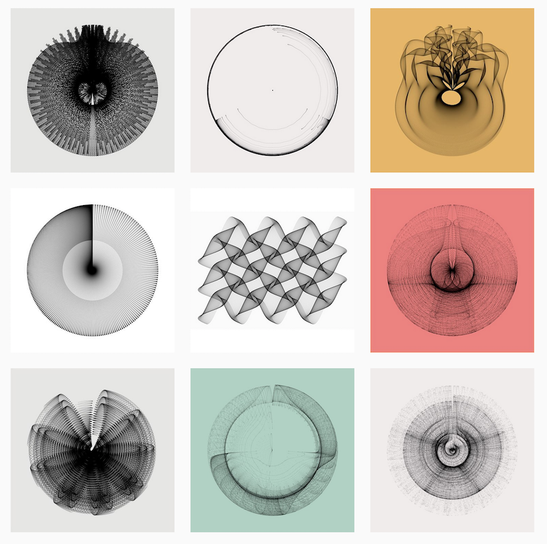

<style type="text/css">
.title-slide {
  background-image: url(https://cran.r-project.org/Rlogo.svg);
  background-position: 50% 0%; ## just start changing this
  background-size: 150px;
  background-color: #fff;
  padding-left: 100px;  /* delete this for 4:3 aspect ratio */
}

.remark-slide-content {
    font-size: 28px;
    padding: 1em 1em 1em 1em;
}

.remark-slide-content > h1 {
  font-size: 32px;
  margin-top: -85px;
}

</style>

# Welcome! First things first: introductions! 

```{r xaringanExtra-search, echo=FALSE}
xaringanExtra::use_search(show_icon = TRUE)
```

```{r xaringan-extra-styles, echo=FALSE}
xaringanExtra::use_extra_styles(
  hover_code_line = TRUE,         #<<
  mute_unhighlighted_code = TRUE  #<<
)
```

```{r xaringanExtra, echo = FALSE}
xaringanExtra::use_progress_bar(color = "white", location = "top")
```

--

`r icons::fontawesome("handshake", style="solid")` My name is written *Димитър* and is pronounced *[diˈ mitər]*. 

--

`r icons::fontawesome("laptop-code", style="solid")` I am *not* a programmer.

--

`r icons::fontawesome("chart-bar", style="solid")` I have done a fair bit of data analysis, visualizations and some programming.

--

`r icons::fontawesome("image", style="solid")` I like pictures.

```{r setup, include=FALSE}
options(htmltools.dir.version = FALSE)
knitr::opts_chunk$set(fig.retina = 3, warning = FALSE, message = FALSE)
```

---
class: inverse, top

background-image: url("figs/mip_env_country.png")
background-size: contain

# Here is a picture that I like (done in R)

---
class: inverse, top

background-image: url("http://dimiter.eu/thumb/DSC_3484.jpg")
background-size: contain

# Not done in R (yes, there's [more](http://dimiter.eu/Photos.html)  where that came from `r icons::fontawesome("smile-wink", style="regular")`)

---
class: left

# What is R?

--
## R is the best thing since sliced bread,

--

    

--
class: left

## only much better, because...

--
.left[unlike bread, it combines *functional*  with *object-oriented* programming,]

--
.left[and it is not sliced, but modular, so that it can be easily extended with new packages.]

---
# Downsides of R

--

It is called R.

--

It comes with no customer support.

--

It regularly leads people into arguments about how good it is.

--

Error messages are rarely informative.

--

It is not made for data entry (though if you insist, look [here](https://www.sebastianvanbaalen.se/uploads/tutorial-data-collection-app)).

---
# What can you do with R? (1)

## Fun things, such as:
- Run (m)any statistical models, including Bayseian models (e.g. with [STAN](https://mc-stan.org/users/interfaces/rstan))
- Do automated text analysis (e.g. with [quanteda](https://quanteda.io/)) and machine learning (e.g. with [tensorflow](https://cran.r-project.org/web/packages/tensorflow/index.html))
- Interact with Large Language Models (LLMs) (e.g. with [chattr](https://mlverse.github.io/chattr/) and [tidychatmodels](https://albert-rapp.de/posts/20_tidychatmodels/20_tidychatmodels))

---
# What can you do with R? (2)

## Access data: 
- From any type of file (Stata, SPSS, Excel, text, etc.)
- Directly from the web via APIs (e.g. [World Bank](https://cran.r-project.org/web/packages/wbstats/vignettes/wbstats.html))
- Scrape complex internet sites and databases (e.g. [EUR-Lex](https://eur-lex.europa.eu/))

---
# What can you do with R? (3)

## Do other important things, such as:
- Well-formatted conference programs from excel sheets `r icons::fontawesome("surprise", style="regular")`
- Presentations like this one (with `RMarkdown` and [xaringan](https://cran.r-project.org/web/packages/xaringan/index.html)) `r icons::fontawesome("code")`

- Practice open reproducible science `r icons::academicons("open-data")` `r icons::academicons("open-materials")` `r icons::academicons("dataverse")` with [`Quarto`](https://quarto.org/).

---
# Art with R, by Katharina Brunner

.center[]

---
# How can you learn to use R?

--
## 1. Get a good foundation `r icons::fontawesome("columns")`

--
## 2. Learn by doing
2.1 with lots of support form the R community on blogs and StackOverflow `r icons::academicons("stackoverflow")`

2.2 adapting other people's code `r icons::fontawesome("github")`

2.3 and asking LLMs for help `r icons::fontawesome("comment-dots")`

--
## 3. You can also get good old-fashioned books `r icons::academicons("obp")`

---
# Recommended books

 [R for Data Science](https://amzn.to/38NYJUr),  ([link to a free version](https://r4ds.had.co.nz/))

 [Advanced R](https://amzn.to/2RDFBCM),  ([link to a free version](http://adv-r.had.co.nz/))

 [R Cookbook](https://amzn.to/2RE5hPT), ([link to a free version](http://www.cookbook-r.com/))

 [The R Book](https://amzn.to/2GxmDrh), ([link to a free version](https://www.cs.upc.edu/~robert/teaching/estadistica/TheRBook.pdf))

---
# Additional resources
[An introduction to R by the R Core Team (pdf)](https://cran.r-project.org/doc/manuals/r-release/R-intro.pdf)

[R Studio Primers](https://rstudio.cloud/learn/primers)

[A very short intro to some of R's programming features](https://www.johndcook.com/blog/r_language_for_programmers/)

[Learn R interactively in R, with Swirl](https://swirlstats.com/)

[A free introductory online course at DataCamp](https://www.datacamp.com/courses/free-introduction-to-r)

[An intermediate course at DataCamp](https://www.datacamp.com/courses/intermediate-r)

---
# Even more resources
[Companion to the book 'Data analysis for social science'](https://ellaudet.github.io/dss_instructor_resources/)

[A short introductory tutorial by Chris Hanretty](https://chrishanretty.co.uk/conveRt/#1)

[Another great introduction for political scientists](https://m-freitag.github.io/intro-r-polsci/)

[YaRrr! The Pirate’s Guide to R](https://bookdown.org/ndphillips/YaRrr/)

---
# What can you expect from this tutorial?

--
`r icons::fontawesome("lightbulb")` Get started and get inspired. 

--
`r icons::fontawesome("columns")` Get a good foundation, hopefully. 

--
`r icons::fontawesome("chalkboard-teacher")` Learn enough so you can continue learning on your own. 

---
# Organization of the meetings

.pull-left[
## Session 1: Introduction to R
- Workflow
- Fundamentals, objects and functions
- Conditional evaluation and loops

## Session 2: Data wrangling
- Importing data
- Restructuring datasets
- Recoding variables
- Merging and exporting data
]

.pull-right[
## Session 3: Data analysis
- Data summary and simple linear models
- Generalized linear models (logistic regression)
- Multilevel models
- Generating tables

## Session 4: Data visualization
- with `plot`
- with `ggplot2`
]

---
# By the end of the tutorial...

## You should not think about working with any other software for your data work<sup>1</sup>.


.footnote[
  [1] Unless you have to work with the uninitiated.
    ]    
  
---
# Let's get started (1)

--
`r icons::fontawesome("terminal")` We can work with R directly (from the console/terminal), but it would be nice if we could save our work somehow.

--
`r icons::fontawesome("copy")` We can use any text editor and *copy and paste* the code, but this gets boring pretty quickly.

--

`r icons::fontawesome("laptop-code")` So we use programs such as [**R Studio**](https://posit.co/download/rstudio-desktop/) that integrate a text editor linked to **R** and some other nice features.

--

`r icons::fontawesome("code")` We write in a text file (script) and send commands using `Cntr+ENTER` to be executed in the console.

---
# Let's get started (2)

You can customize the appearance of code in *RStudio*.

`r icons::fontawesome("hat-wizard")` **Protip:** Use an *R Studio* theme that highlights code (I use *Pastel on Dark*).
`r icons::fontawesome("hat-wizard")` **Protip:** Turn on *rainbow brackets*.
`r icons::fontawesome("hat-wizard")` **Protip:** *R Studio* has useful shortcuts (see them all with `Alt+Shift+K`). Learn and use some of them (e.g. `Cntr+1`/`Cntr+2`). 

---
# General grammatical features of R as a language
`r icons::fontawesome("check")` Functions have arguments in parentheses, separated by commas (unlike in Excel).
`r icons::fontawesome("check")` Capitalization of object and function names matters.
`r icons::fontawesome("check")` Intervals and indents in your code do not matter (unlike in Python). But they matter inside object and function names.
`r icons::fontawesome("check")` You can use single or double quotation marks, also nested within each other. But be careful to close like with like.

---
# Files and projects (1)

--
`r icons::fontawesome("file")` We can start a file, write code, execute the code, and - when we are happy - we can save the file (with an `.r` extension, but it remains a text file that can be edited in any text editor). 

--

This might be all we need for very small, simple and individual projects. (Btw, where is our work?)

```{r eval=FALSE}
### Where are we?
getwd()  # oh, here
setwd('C:/my projects/here') # better here
```

---
# Files and projects (2)
`r icons::fontawesome("sitemap")` For more complex projects, you would want to start a *Project*. A project sets up the *working environment* and organizes things in a nice way. Within the project, you can (should) create separate folders for your code, input data, output data, plots, model results, and tables. The code itself can (should) be separated in smaller files (e.g. one for the libraries and functions that you use, one for data import and manipulation, one for statistical analyses, etc.). To start or continue working on a project, you click on the relevant `.Rproj` file, which loads the working environment.

---
# Files and projects (3)
`r icons::fontawesome("code-branch")` Use relative, not absolute paths in your scripts to make collaborative work easier.
```{r eval=FALSE}
### There are good and bad paths
'./data/nl/zh/dh/students.csv' # this is a good path
'C:/data/nl/zh/dh/students.csv' # this is a bad path
```

--
Some additional advice on setting up projects is available [here](https://martinctc.github.io/blog/rstudio-projects-and-working-directories-a-beginner's-guide/).
We will say more about workflow (with `GitHub` and `RMarkdown`) later in this tutorial. 

---
# Some good practices

--
`r icons::fontawesome("edit")` Take the time to annotate your code (using `#` to start a segment of a line that is not executed as code).

--

Think about the names of files and variables that you use. Have a system and be consistent. You can use `.`, or `_`, or capital letters, but stick to one.

```{r eval=FALSE}
### How (not) to name your variables
data.nl.denhaag.bezuidenhout # this is fine
data_nl_denhaag_bezuidenhout # this is also fine
DataNlDenhaagBezuidenhout # this is not so fine
data.Nl_DenHaag_.bezuidenhout # this is definitely not fine
```

---
# Some more good practices

--
Think about about how you name your scripts and other file names as well.

`r icons::fontawesome("hat-wizard")` **Protip:** Use `00_libraries.R`, `01_firstanalysis.R`, etc. to name your scripts in the order that they should be executed, so you can quickly sort them within the folder alphabetically.  

---
# Modularity

R works with packages. 

The default installation comes with basic functionality.

For everything else, you install a package. 

There are multiple packages that can achieve the same task.

There is a special universe of packages called [`tidyverse`](https://www.tidyverse.org/), developed by Hadley Wickham and company, which creates a convenient way to load, wrangle data, analyze and visualize data. We will use these a lot.

---
# Working with packages (1)

Working with packages is easy:
- First, you have to install, from a **CRAN** repository, or from zip files, or via `devtools`. You can install with a command or from the **R Studio** menu. You install a package once on a computer (you might need to update every now and then).

- Once the package is installed, you will want to load it with the `library()` function to use its functions. You have to load the package every session (if you need it, of course).

- You can also directly specify functions from packages for use, e.g. `dplyr::recode()`. This is necessary because different functions in different packages can have the same name. This leads to confusion, both for `R` and for us.

---
# Working with packages (2)

```{r eval=FALSE, collapse=TRUE}
### How to install and load a package
install.packages('dplyr')
library (dplyr)
```

--
`r icons::fontawesome("hat-wizard")` **Protip:** If you work with people who would not know how to install a package but would want to run your code, you can start your code with a function that will install and load packages automatically (see [here](https://stackoverflow.com/questions/4090169/elegant-way-to-check-for-missing-packages-and-install-them))

`r icons::fontawesome("hat-wizard")` **Protip:** Don't do that with people who know their way around R. They don't like your script installing things without their authorization.

---
# Assignment operators (1)

Perhaps the most fundamental operation in R is to assign a value to a named object: `object_name <- value`. Be careful, R is sensitive; *case sensitive*, that is. 

You can be old school<sup>1</sup> and assign values to names with `<-`. Or you can just use `=`. And if you are that cool, you can also use `->`.

.footnote[
  [1] "There is a general preference among the R community for using `<-` for assignment (other than in function signatures) for compatibility with (very) old versions of S-Plus."]
  
---
# Assignment operators (2)
```{r eval=TRUE, collapse=TRUE}
### There are different ways to assign
best.month <- 'August'
best.date = 18
1978 -> best.year

best.date
best.month
best.year
```

---
# Assignment operators (3)

There are some subtle differences among the different assignment operators; if you are interested, read [here](https://stackoverflow.com/questions/1741820/what-are-the-differences-between-and-assignment-operators-in-r).

You also have the assignment operator `<<-`. This is most useful *'in conjunction with closures to maintain state'*. Exactly. If you want to know more, read [here](https://stackoverflow.com/questions/2628621/how-do-you-use-scoping-assignment-in-r).

---
# Vectors (1)
Vectors are one-dimensional collections of objects. 

```{r eval=TRUE,  collapse=TRUE}
### How to make and check a vector
v1 <- seq (1, 50, by=5)
v1
v2 <- c('R', 'pie', 5, NA)
v2
is.vector(v1)
is.vector (v2)
is.vector(c(is.vector(v1), is.vector(v2)))
```

---
# Vectors (2)
There are several different types of vectors: *logical*, *character*, *numeric* (which can be *double* or *integer*), *complex* and *raw*. *Factors* and *dates* are augmented vectors that have a special attribute, their *'class'*.  

```{r eval=TRUE,  collapse=TRUE}
### What vectors?
typeof(v1)
typeof(v2)
typeof(is.vector(c(is.vector(v1), is.vector(v2))))
typeof(c("1", "2", "4"))
```

---
# More on vectors

`r icons::fontawesome("hat-wizard")` **Protip:** In R, numbers are 'doubles' by default. To make an 'integer', place an `L` after the number (e.g.`2L`). This can save some trouble down the road. Alternatively, use `round()` when evaluating.
```{r eval=TRUE,  collapse=TRUE}
0.3/3 == 0.1 # floating point bizzaro
round(0.3/3,1) == 0.1
unique(c(.3, .4 - .1, .5 - .2, .6 - .3, .7 - .4))
```   

Integers have one special value: `NA`, while doubles have four: `NA`, `NaN`, `Inf` and `-Inf`. 
```{r eval=TRUE,  collapse=TRUE}
c(-1, 0, 1) / 0     
```     

---
# Coercion (1)
Use can coerce one type of vector to another. But be gentle and beware the consequences.

```{r eval=TRUE,  collapse=TRUE}
v1 <- c(1,2,4)
typeof(v1)
f1 <- as.factor(v1)
f1
n1 <- as.numeric(f1)
is.numeric(n1)
n1 # OMG!!!
n2 <- as.numeric(as.character(f1))
n2 # that's better!
```

---
# Coercion (2)
Coercion happens without your help (and perhaps realization) as well, every time you mix vector elements of different types together. The most complex type prevails.
```{r eval=TRUE,  collapse=TRUE}
v1 <- seq(1:999)
is.numeric(v1)
length(v1) # vectors have length
v2 <- c(v1, '1000')
is.numeric(v2)
typeof(v2) # it only takes one
```

---
# Character vectors
Character vectors are the most complex type of atomic vector, because each element of a character vector is a string, and a string can contain an arbitrary amount of data.

Working with strings and character vectors is very common in data analysis. There are a couple of very useful operations with strings that we should learn right away:
```{r eval=TRUE,  collapse=TRUE}
v.char <- c("alpha", "beta", "gama")
substr(v.char, 1, 2) # get the first two letters of every element 
nchar(v.char) # count the number of characters in each string
toupper(v.char) # capitalize each element
```
The package [`stringr`](https://stringr.tidyverse.org/) has handy functions for more advanced operations.
  
---
# Lists 
Lists, also called recursive vectors, can contain all kinds of things, including other lists.

`y <- list("a", 1L, 1.5, TRUE)`

Data frame are lists of a special class:

`typeof(data.frame(NA))`

`class(data.frame(NA))`

---
# Navigating our objects
There are different ways in which we can navigate to and access elements of our objects.

--
We can do that by position or name:
```{r eval=TRUE,  collapse=TRUE}
x <- rnorm(100 ,0, 1) # let's generate some randomness 
y <- rnorm(100 ,0, 1) # let's generate more randomness 
m <- cbind(x,y) # let's bind randomness together in a ....
class(m)
dim(m)
length(x)
df<-data.frame(m)
```

---
# Navigation examples

```{r eval=TRUE,  collapse=TRUE}
x[1]
m[1,1]
m[1:5, -2]
df[seq(1, 100, 10), "y"]
```

--
Navigating lists is more complicated. We have to use `x[[ n ]]` to get the n-th element of list `x`. That element itself could be anything (e.g. a data frame).

---
# Some basic functions for summarizing data
First steps are easy
```{r eval=TRUE,  collapse=TRUE}
mean(x)
sd(y)
quantile(m)
range(df)
summary(df)
```

---
# But it can get more tricky. Note that we can use the dollar sign `$` to access columns (variables) of a data frame.

```{r eval=TRUE,  collapse=TRUE}
df <- rbind(df, c(NA,NA)) # bind rows together
tail(df)
sum(df$x) # oops
sum(df$x, na.rm=TRUE) # ok, R is very careful with missing data 
```

---
# And more tricky

```{r eval=TRUE,  collapse=TRUE}
sum(df)
df$z <- rowSums(df) 
tail(df, 2)
df$z <- rowSums(df, na.rm=TRUE)
tail(df, 2)
```

---
# LOOPS (1)
Loops are a fundamental programming technique, in which we iterate over a predefined sequence and apply a function to each element.

```{r eval=TRUE,  collapse=TRUE}
for (i in 1:5){
   print(round(df[i,], 2))
}
```
Most of R functions are vectorized, which means that we do not have to loop over the elements of a vector to apply the function to each element separately. Yet, in some cases loops can be handy.


---
# LOOPS (2)

We can also create new objects in loops: 

```{r eval=TRUE}
for (i in 1:dim(df)[1]){
    df$our.sum[i] <- sum(df[i,1:2], na.rm=TRUE)
}
df[c(1,100:101),]
```

You can read more about loops [here](https://www.datacamp.com/community/tutorials/tutorial-on-loops-in-r).

---
# Comparisons (evaluation)
Sooner or later, we all become judgmental:

These are the main evaluation functions: `>`, `>=`, `<`, `<=`, `!=` (not equal), and `==` (equal).

With logical operators, we can mix thing up a bit: `&` is “and”, `|` is “or”, and `!` is “not”. 
   
Be careful with missing values:  almost any operation involving an unknown value will also be unknown.

---
# Comparisons (2)

We can check for missing data: `is.na(x)` or even better `which(is.na(df$x))`.

```{r eval=TRUE,  collapse=TRUE}
which(df$x > 1)
w1 <- which(df$x > 1)
length(w1)
w2 <- which(df$y>1)
length(w2)
```

Check whether the last row of `df` has elements greater than 1.

---
# Conditionals (1)
Conditional evaluation is another fundamental programming technique. 

```{r eval=FALSE,  collapse=TRUE}
  if (this) {
     # do that
   } else if (that) {
     # do something else
   } else {
     # 
   }
```

---
# Conditionals (2)
For very short evaluations we can also use the `ifelse` one-liner: `ifelse(evaluate, do.this.if.true, do.this.if.false)`. These simple statements can be nested, but it is better to use the extensive form shown above.

```{r eval=TRUE,  collapse=TRUE}
for (i in 1:length(df$x)){
   if (is.na(df$x[i]) == FALSE & is.na(df$y[i]) == FALSE) {
      df$out.sum2[i] <- sum(df[i,1:2])
   } else {
       df$out.sum2[i] <- NA
   }
}
```

---
# Functions
Objects are staff with names and values. Functions do things to objecs.

In R you can easily write your own functions. Just give them a name and tell them what to do

```{r eval=TRUE,  collapse=TRUE}
sum.na <- function (x) {sum(x, na.rm=T)} # sum that avoids NAs 
sum.na(c(3,5,NA))

sum.allna <- function (x) {if (all(is.na(x))) NA 
  else sum(x, na.rm=T)} # sum that avoids NAs but returns NA if all NAs
sum.allna(c(NA,NA))
```

You can read more about functions [here](https://www.datacamp.com/community/tutorials/functions-in-r-a-tutorial).

---
# Strings and factors

## Strings
You can create strings with either single quotes or double quotes.
Multiple strings are often stored in a character vector, which you can create with `c()`.

## Factors
In R, factors are used to work with categorical variables: variables that have a fixed and known set of possible values. They are also useful when you want to display character vectors in a non-alphabetical order. You can read more about factors [here](https://www.datacamp.com/tutorial/factors-in-r). 

If you ever need to access the set of valid factor levels directly, you can do so with `levels()`. You can also re-asign the levels of a factor with `levels()`.
   
---
# When things don't woRk as expected `r icons::fontawesome("sad-cry")`

`r icons::fontawesome("bug")` Most often, code breaks because of punctuation errors (misspelled verbs and object names; parentheses and quotation marks that are not closed or are closed at the wrong place; capitalization errors; intervals in function and object calls, etc.)

`r icons::fontawesome("bug")` Trying to apply a function to an object of the wrong type is a major source of errors.

`r icons::fontawesome("bug")` Functions with the same name residing in different packages can cause confusion (e.g. `recode()` in `car` and `recode()` in `dplyr`).

`r icons::fontawesome("bug")` Having the correct arguments, but in the wrong place in function calls.

---
# Some solution strategies

`r icons::fontawesome("thumbs-up")` Inspect your code for grammatical errors.

`r icons::fontawesome("thumbs-up")` Read the documentation of the function that breaks the code.

`r icons::fontawesome("thumbs-up")` Check that objects exist and have the expected type.

`r icons::fontawesome("thumbs-up")` Isolate the problem by working step-by-step. Replicate the problem on a small subset of your data.

`r icons::fontawesome("thumbs-up")` Google the text of the error message. Ask LLMs for help.

---
# How to get in touch?

`r icons::fontawesome("envelope")` demetriodor@gmail.com

`r icons::fontawesome("chrome")` [http://dimiter.eu](http://dimiter.eu)

`r icons::academicons("conversation")` @dtoshkov.bsky.social

`r icons::fontawesome$brands$twitter` @DToshkov

`r icons::fontawesome("github")` [github.com/demetriodor](https://github.com/demetriodor/)

`r icons::fontawesome("linkedin")` Dimiter Toshkov

